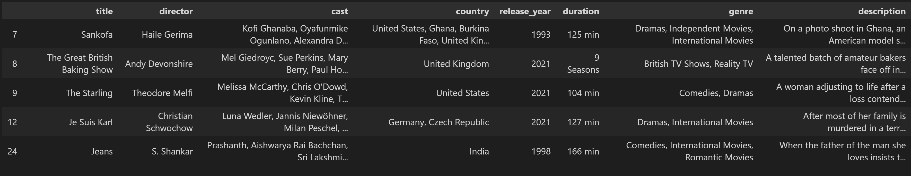
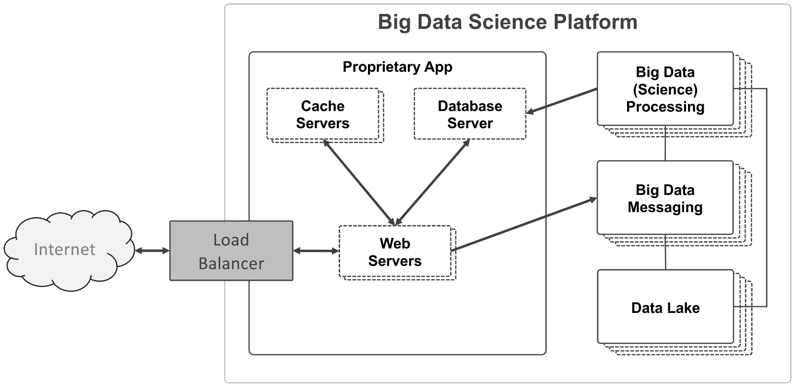

>This is a project for the lecture "Big Data" in the third and fourth semester. Course: WWI20DSB  

Contributors (matr. number):    
- Anh Vu (1039624)   
- Florian Frey (7199749)
- Frederick Neugebauer (4521985)
- Olena Lavrikova (5436924)
- Zabiullah Salehi (7891497)


# Idea: Popular Netflix Movies and Shows

The idea behind the project is to rate movies and shows according to their views and similarities on the website.  
A movie or show gets 5 points for each view on itself and 1 additional point everytime another show or movie with the same director is viewed.  
By that, a list of the most popular shows is created. With that list, users can easily access popular content without having to search for it.  

# Data

To get the data needed to accomplish the described idea the ["Netflix Movies and TV Shows" dataset](https://www.kaggle.com/datasets/shivamb/netflix-shows) from Kaggle was used.
The dataset is also saved as `netflix_titles.csv` in the data directory.  
After some pre-processing in `transform_data.ipynb` the dataset contains the following attributes:
```
title:			Title of the movie or series.
director:		Main director of the title.
cast:			Actors participating in the movie/series.
country:		Country the title was produced in.
release_year:		Release year.
duration:		Film duration or amount of seasons.
genre:			List of genres.
description:		Short summary of the movie/series.
```
Here is a screenshot of the sample dataframe: 


# Screencast

Here you can see a demo of the application:

https://user-images.githubusercontent.com/83298480/188093215-3db667ed-6999-4508-a690-8c399c5cef45.mp4

# Architecture



The figure above shows the architecture of a typical big data application.  
Through the internet, pictured on the left, the users can access the web application. A load balancer helps to distribute the user requests to the instances of our web servers. The web servers are connected to the database of the application and several cache servers which help relieve traffic on the database.  
The three frames on the right are essential for a _big data_ application. The web servers send the data generated by the users to the big data messaging service. The service can send the data to the processing unit or store the data stream into a data lake from where it can be processed later on. The computed results are written into the database.


# Implementation

## Repository Content

The repository contains the following directories:  

**📂data**   
➡ containing the dataset and a jupyter notebook to preprocess and convert the data into ddl statements, saving the results into `mariadb-dump.sql`  

**📂k8s**  
➡ .yaml-files used to define the deployment   

**📂spark-app**  
➡ spark application which processes the kafka stream messages and saves the results into the database  

**📂src**   
➡ contains images and other material used in this documentation  

**📂web-app**  
➡ contains necessary elements to build the web application

And the `📄skaffold.yaml` file to run the cluster (more on this [later](#guide-to-run-the-application)). As well as the `🔑LICENSE.md` and this `💡README.md`.

## Used technologies
A simple node.js app is used in this project for the web application. It can be found at `web-app/index.js` and contains the configurations to connect to the database and cache servers as well as functions and html to display the web application correctly. Moreover, it sends the generated data (views of shows) to the big data messaging service. For further details please refer to the code and its comments.  

Load balancing is done by the kubernetes cluster. The cache servers use the memecached software while the used database system is mariadb. The configurations for these components are defined in the respective `k8s/*.yaml` files.

For the big data part of the application, Spark, Kafka and a Hadoop Distributed File System (HDFS) are used. While Spark is used for coordination and processing of large amount of data, Kafka allows the communication between the web application and the Spark application. 
Spark reads the streamed data and aggregates it into clustered time frames in order to perform calculations. This open source streaming system optimizes a high error tolerance and scalability in the application. Furthermore, it prevents that the transmitter overloads the receiver.
The HDFS is particularly suitable for the distributed storage of large amounts of data and is therefore used in the big data environment. With an integrated automatic duplication of the data, failures of individual instances can be intercepted without data loss.

## Course of the project

After finalizing the idea for the project, the code adjustments started.  
First, the dataset was downloaded and preapred. This was done using a jupyter notebook to drop some unnecessary columns, rows with null values and to only keep the main (first) director of a show for the rating logic later on. The finished dataframe was then transformed into SQL statements and saved into the `mariadb-dump.sql` file to populate the database of the application. Because of the quantity of data, the additional file was needed to keep the `mariadb.yaml` file readable and avoid problems when deploying the cluster.
Then the schema of the mariadb database needed to be defined. One relation stores the information about our dataset while the second relation will save the calculated rating of shows.  
The web application was adjusted to the requirements of the use case. As seen in the [demo](#screencast), the website shows a list of all available titles. With a click on a title the application queries the cache or the database and a detailed page with all of its information is shown and a view is simulated. With enough clicks on shows, a list of the most popular shows, calculated by the [idea](#idea-popular-netflix-movies-and-shows) described above, will be displayed on top of the home page. The web application sends tracking data including the id of the viewed show, its director and a timestamp to the kafka stream, so the information can then be processed by the Spark application.  
In the `spark-app.py` the window and sliding duration were adjusted. The window duration defines the time frame in which clicks of the shows are considered for calculation of the rating. The sliding duration is used to set the interval for updating the most popular shows.
The schema for reading the kafka stream was fitted on the tracking messages sent by the web application.  

Later, the logic for computing the rating was implemented. In a first step, the views of each show are counted. With a left outer join on matching directors of the viewed shows, another score to reward the shows with the same director was calculated. Unfortunately, the final join of the two calculations, to receive the ultimate rating, does not work as intended. 
After computing the rating it needs to be written into the database for the web application to access. For this, the connector to the mariadb database needed to be fixed, because it was not working in the given template.

The rating could still be improved by considering more features which help to identify similarities betweens shows. For example shows having the same genres, made in the same country or featuring similar actors. Besides calculating a rating for showing the most popular shows, this could also be used to recommend shows to individual users based on the movie or series they are watching.

# Guide to run the application

To run the application on your local machine you need installations of [Docker Desktop](https://www.docker.com/products/docker-desktop/), [Minikube](https://minikube.sigs.k8s.io/docs/start/), [Helm](https://helm.sh/docs/intro/install/) and [Skaffold](https://skaffold.dev/docs/install/). Please refer to the linked documentations for instructions on how to install the software on your operating system.

Start a Kubernetes Cluster with the Docker Engine by executing:
```
minikube start --driver=docker --memory 14336 --cpus 4
```

Deploy a Strimzi.io Kafka operator:
```
helm repo add strimzi http://strimzi.io/charts/
helm install my-kafka-operator strimzi/strimzi-kafka-operator
kubectl apply -f https://farberg.de/talks/big-data/code/helm-kafka-operator/kafka-cluster-def.yaml
```

Start a Hadoop cluster with YARN (for checkpointing):
```
minikube ssh docker pull danisla/hadoop:2.9.0
helm repo add stable https://charts.helm.sh/stable
helm install --namespace=default --set hdfs.dataNode.replicas=1 --set yarn.nodeManager.replicas=1 --set hdfs.webhdfs.enabled=true my-hadoop-cluster stable/hadoop
```

To deploy the remaining pods use:
```
skaffold run
```

When the database is ready (check this via `kubectl logs \<mariadb-pod-name>`) populate it with data:
```
kubectl exec -i \<mariadb-pod-name> -- mariadb -uroot -pmysecretpw netflix_titles < data/mariadb-dump.sql
```

Run the following command and access the app via the url you'll receive:
```
minikube service popular-slides-service --url
```
